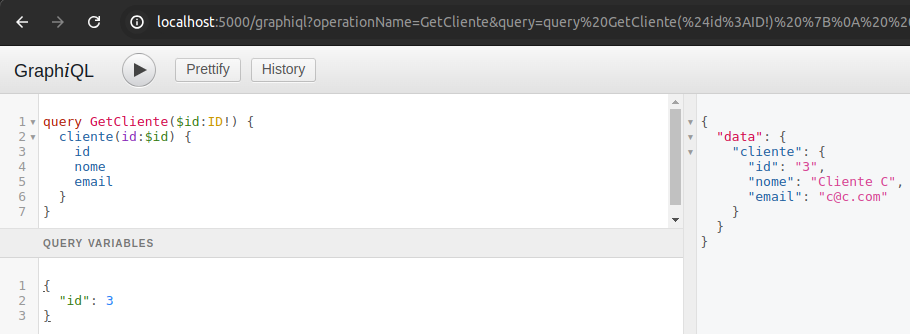

## Run Configuration

Use this VM Option `-Dspring.profiles.active=dev`

## URLs

[Original repo with source code](https://github.com/rlechetaudemy/springboot_graphql)    
[Playground](https://github.com/graphql/graphql-playground)  
[Graphql doc](https://graphql.org/learn/)  
[Scalar types](https://graphql.org/learn/schema/#scalar-types)  
[Mutations](https://graphql.org/learn/queries/#mutations)  

## Local URLs

```
We are using port 5000 in all URLs because of this config in the application.properties:
server.port=${PORT:5000}
Otherwise, it would be 8080.

Hello World Rest to test application:
http://localhost:5000/hello

GraphiQL URL:
http://localhost:5000/graphiql

Playground URL:
http://localhost:5000/playground

Schema:
http://localhost:5000/graphql/schema.json
```

## GraphQL Queries (introduction video)

### Sections 1 & 2

```js
{
  hello
}
```

```js
{
  hello,
  soma(a:1, b:2)
}
```

```js
{
  hello,
  clientes {
    id, nome, email,
  }
}
```

```js
{
  hello,
  cliente(id:1) {
    id, nome, email,
  }
}
```

```js
{
  hello,
  c1: cliente(id:1) {
    id, nome, email,
  },
  c2: cliente(id:2) {
    id, nome, email,
  },
}
```

```js
{
  hello,
  produtos {
    id, nome, valor
  },
}
```

```js
mutation {
  saveProduto(produto: {
    nome: "Teste",
    valor: 150
  }) {
    id, nome, valor
  }
}
```

```js
{
  hello,
  clientes {
    id, nome, email,
    compras {
      quantidade, status, data
    }
  }
}
```

```js
{
  hello,
  clientes {
    id, nome, email,
    compras {
      quantidade, status, data,
      produto {
        nome, valor
      }
    }
  }
}
```

```js
{
  compras(page:0, size:2) {
    id, quantidade, status, data,
    produto {
      nome, valor
    }
  }
}
```

```js
{
  compras(page:1, size:2) {
    id, quantidade, status, data,
    produto {
      nome, valor
    }
  }
}
```

```js
{
  compras {
    id, quantidade, status, data
    produto {
      nome
      valor
    }
    cliente {
      nome
      email
    }
  }
}
```

## GraphQL Queries (step by step)

### Section 3

```js
{
  hello,
  soma(a:1, b:2),
  cliente(id:2) {
    id
    nome
    email
  },
  clientes {
    id
    nome
    email
  }
}
```

```js
{
  clientes{
    id,nome,email
  }
}
```

It works on branch 03-GraphQL-custom (with port 8080):  
```js
mutation {
  saveCliente(nome:"Bruno Sant' Ana",email:"bruno.santana@gmail.com"){
    id,nome,email
  }
}
```

It works on branch 03-GraphQL-custom (with port 8080):
```js
mutation {
  saveCliente(id:4,nome:"Bruno Sant' Ana",email:"bruno.santana.ti@gmail.com"){
    id,nome,email
  }
}
```

```js
mutation {
  deleteCliente(id:4)
}
```

### Section 4

```js
{
  a: cliente(id:1) {
    ...fragCliente
  },
  b: cliente(id:2) {
    ...fragCliente
  },
  clientes {
    ...fragCliente
  }
}

fragment fragCliente on Cliente {
  id,nome,email
}
```

```js
mutation {
  saveCliente(cliente:{id:2,nome:"Teste Input Type",email:"teste@gmail.com"}){
    id,nome,email
  }
}
```

```js
query GetCliente($id:ID!) {
  cliente(id:$id) {
    id
    nome
    email
  }
}

// Query Variables:
{
  "id": 3
}
```
  

### Section 5

```js
{
  produtos {
    id,nome,valor
  }
}
```

```js
{
  produto(id:1) {
    id,nome,valor
  }
}
```

```js
mutation {
  saveProduto(produto:{nome: "Teste",valor: 100}) {
    id, nome, valor
  }
}
```

```js
mutation {
  deleteProduto(id:6)
}
```

```js
mutation {
  saveCompra(compra:{
    clienteId:1,
    produtoId:1,
    quantidade:10,
    status:"OK"
  }) {
    id,quantidade,status
  }
}
```

```js
{
  compras {
    id,
    quantidade,
    status,
    cliente {
      id,nome
    },
    produto {
      id,nome,valor
    }
  }
}
```

```js
mutation {
  deleteCompra(id:4)
}
```

### Section 6

Using a resolver for valorReais (ProdutoResolver):
```js
{
  produtos {
    id,
    nome,
    valor,
    valorReais
  }
}
```

Using a resolver for compra (CompraResolver) 
in order to get the cliente and produto associated with each compra:
```js
{
  compras {
    id,
    quantidade,
    status,
    cliente {
      id,nome
    },
    produto {
      id,nome
    }
  }
}
```

Using a resolver for cliente (ClienteResolver)
in order to get all compras for a given cliente:
```js
// all clientes
{
  clientes {
    id
    nome
    email
    compras {
      id,quantidade
      produto {
        nome,valor
      }
    }
  }
}

// cliente 1
{
  cliente(id:1) {
    id
    nome
    email
    compras {
      id,quantidade
      produto {
        nome,valor
      }
    }
  }
}
```

### Section 7

Using query with join:
```js
{
  comprasRelatorio {
    compraId,
    cliente,
    produto,
    quantidade
  }
}
```

Using pagination:
```js
{
  compras(page:0) {
    id,
    quantidade,
    status,
    cliente {
      id,nome
    },
    produto {
      id,nome,valor
    }
  }
}
```

Using pagination and size:
```js
{
  compras(page:0,size:4) {
    id,
    quantidade,
    status,
    cliente {
      id,nome
    },
    produto {
      id,nome,valor
    }
  }
}
```

## Live demo (graphiql)

[graphiql](https://github.com/graphql/graphiql)  
[Live demo](https://graphql.github.io/swapi-graphql/)

## Queries live demo

```js
{
  allFilms {
    films {
      title
      director
    }
  }
}
```

## Docker commands

```
Spin up a MySQL container:
docker run --name my-mysql --network my-bridge-network -e MYSQL_ROOT_PASSWORD=mypass -d mysql:latest
From the second time you can simply run:
docker start my-mysql

Find out the IP of the MySQL container:
docker inspect -f '{{range .NetworkSettings.Networks}}{{.IPAddress}}{{end}}' my-mysql

Connect in the MySQL using a client:
docker run -it --network my-bridge-network --rm mysql mysql -h172.21.0.2 -uroot -p

Stop the container when you're finished:
docker start my-mysql
```